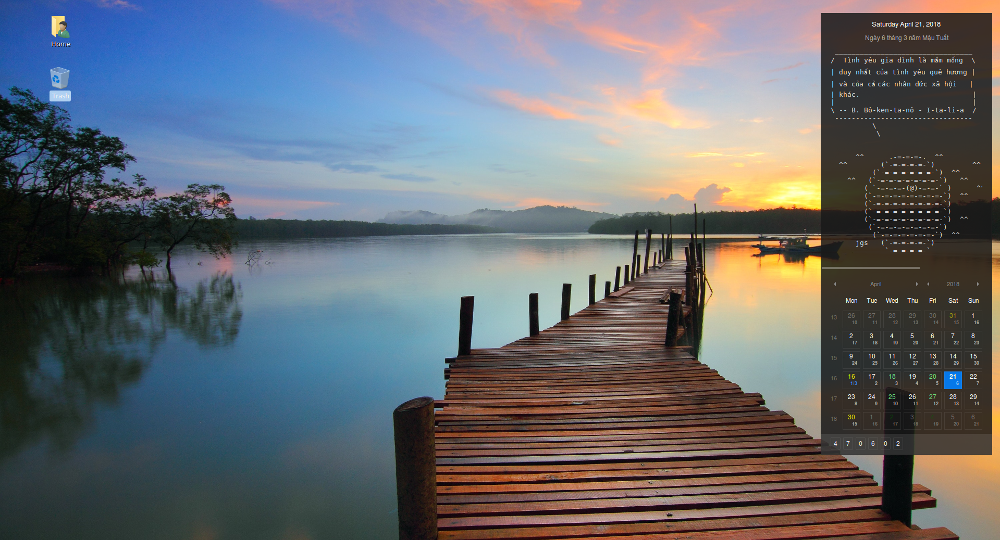
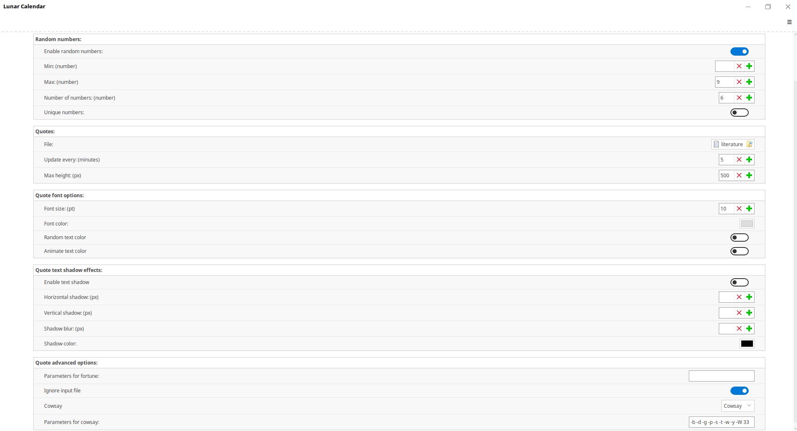
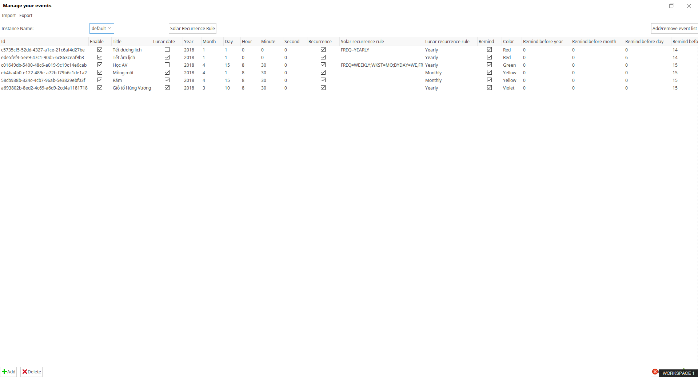

# vietnamese-lunar-calendar-desklet

## Prerequisites
Install [cowsay](https://en.wikipedia.org/wiki/Cowsay) and [fortune](https://en.wikipedia.org/wiki/Fortune_(Unix)).

## Installation

1. Copy folder `LunarCalendarDesklet@x` to `/home/{username}/.local/share/cinnamon/desklets`.
2. Copy all files under `LunarCalendarDesklet@x/cows` to `/usr/share/cowsay/cows`.
3. Copy all files under `LunarCalendarDesklet@x/fortunes` to `/usr/share/games/fortunes`.
4. Add desklet `Lunar Calendar`.

## Screenshots

Desklet

Config

Manage events

## References

Inspired from [Quote of the day desklet](https://cinnamon-spices.linuxmint.com/desklets/view/16) and [Feeds Reader](https://cinnamon-spices.linuxmint.com/applets/view/149).